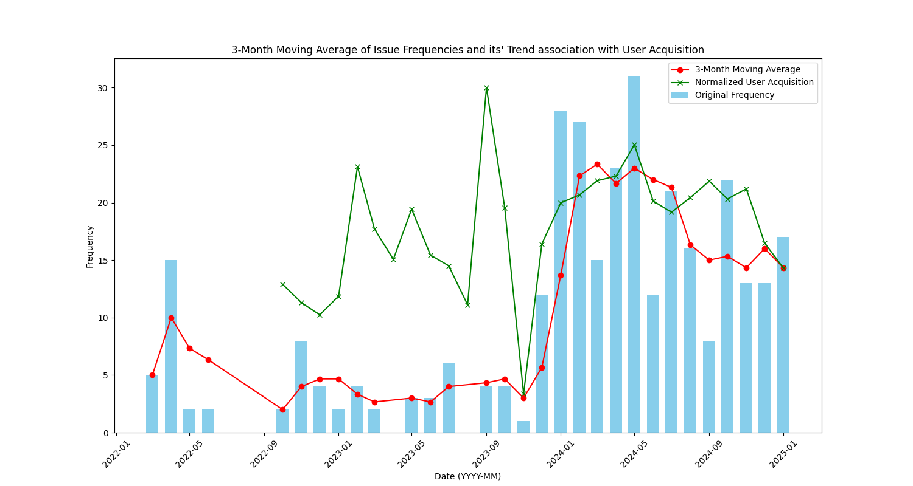

# SPAM (Sensitive Passive Aggresive Mailman)

[](LICENSE)
[](https://www.python.org/)

## Overview

Your active website may receive large amount of information from the users which may be hard to analyze through
man-power; hence, there may be a need for sentiment analysis on the qualitative data received from the user.
One method to analyze this qualitative information may be LLMs but due to privacy issues the use of LLM
is severely restricted. To evade this issue, Natural Language Processing (NLP) techniques and pre-existing
libraries can be used to capture user sentiment OR identify commonly occuring issues.

---

## Table of Contents

- [Overview](#overview)
- [Installation](#installation)
- [Usage](#usage)
- [Features](#features)
- [License](#license)
- [Contact](#contact)
- [TODO](#todo)
- [Result](#result)

---

## Installation

1. Clone the repository:
   ```bash
   git clone https://github.com/TKartist/SPAM.git

## Usage

1. Automatically collects claim emails received on the target account
2. Sort out the relevant review emails using key words, email tags, and other commonly occuring patterns
3. Apply NLP techniques on pre-processed (lemmatization, tokenization and etc) review data, and extract meaningful information such as commonly 
   occuring words / user sentiments

## Features
1. Automatic Collection of Emails
2. Pre-Processing of reviews (categorization, extraction of content from HTML)
3. Groups emails by conversationID
4. Performs sentiment analysis with vader (Python Library) and word frequencies


## TODO
1. Think of training a model for the categorization using Neural Networks. (NLP)
2. Extract issues from GitHub issues
3. Collect issues from SIMS slack 

## Result

